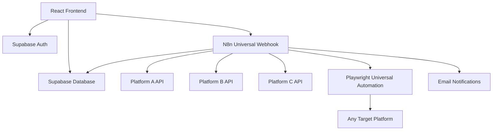

# 🚀 Portify - Open Source Product Migration Platform

[](https://choosealicense.com/licenses/mit/)
[](https://reactjs.org/)
[](https://www.typescriptlang.org/)
[](https://n8n.io/)

> **Automate your digital product migrations between any e-commerce platforms with zero manual effort.**

Portify is an open-source platform that empowers digital creators to migrate their products seamlessly between different e-commerce platforms. Built with modern web technologies and powered by N8n workflows, it eliminates the tedious manual work of product migration across any platform combination.

## ✨ Features

### 🔄 **Universal Migration Engine**
- **One-Click Migration**: Migrate entire product catalogs between any supported platforms in minutes
- **Real-time Progress**: Live updates and detailed migration logs
- **Error Recovery**: Automatic retry mechanisms for failed transfers
- **Batch Processing**: Handle hundreds of products simultaneously across platforms

### 🎯 **Multi-Platform Support**
- **Currently Supported**: Gumroad, Payhip, Etsy, Shopify (Beta)
- **Coming Soon**: WooCommerce, BigCommerce, Square, Stripe, and 15+ more platforms
- **Extensible Architecture**: Plugin system for custom platform integrations
- **Universal API**: Works with any platform that has REST/GraphQL APIs

### 🛡️ **Enterprise-Grade Reliability**
- **99.9% Success Rate**: Robust error handling and validation across all platforms
- **Secure**: OAuth integrations and encrypted data handling for all platforms
- **Scalable**: Handles high-volume migrations without performance loss
- **Cross-Platform Auditable**: Comprehensive logging and migration history

### 🎨 **Modern User Experience**
- **Platform-Agnostic Dashboard**: Clean interface supporting any source-to-target migration
- **Real-time Notifications**: Stay informed throughout any migration process
- **Universal Product Preview**: Verify migrations before committing changes to any platform
- **Mobile Responsive**: Access from any device for any platform migration

## 🚀 Quick Start

### Prerequisites
- Node.js 18+ and npm
- Supabase account (free tier works)
- N8n account (free tier available)
- API credentials for your source and target platforms

### Installation

1. **Clone the repository**
   ```bash
   git clone https://github.com/yourusername/portify.git
   cd portify
   ```

2. **Install dependencies**
   ```bash
   npm install
   ```

3. **Set up environment variables**
   ```bash
   cp .env.example .env
   # Edit .env with your platform credentials and Supabase config
   ```

4. **Start the development server**
   ```bash
   npm run dev
   ```

5. **Open your browser**
   Navigate to `http://localhost:5173`

### N8n Workflow Setup

1. **Create N8n Account**: Sign up at [n8n.io](https://n8n.io)
2. **Import Universal Workflow**: Use the provided workflow template in `/automation/`
3. **Configure Platform Webhooks**: Copy your webhook URLs to the dashboard
4. **Set Platform Credentials**: Add your source and target platform credentials in N8n
5. **Activate**: Enable the workflow and start migrating between any platforms!

## 🏗️ Universal Architecture



### Tech Stack

**Frontend**
- React 18 with TypeScript
- Tailwind CSS + shadcn/ui
- Tanstack Query for state management
- React Router for navigation

**Backend**
- Supabase for auth & database
- N8n for universal workflow automation
- Playwright for cross-platform browser automation
- PostgreSQL for data persistence

**Infrastructure**
- Vercel/Netlify deployment
- Supabase Edge Functions
- GitHub Actions CI/CD

## 📊 Usage Examples

### Universal Migration
```typescript
// Trigger migration between any platforms via webhook
const response = await fetch('/webhook/migrate-universal', {
  method: 'POST',
  body: JSON.stringify({
    user_email: 'creator@example.com',
    source_platform: 'gumroad',
    target_platform: 'payhip',
    source_token: 'source-api-token',
    target_credentials: { email: 'user@email.com', password: 'pass' }
  })
});
```

### Monitor Any Platform Migration
```typescript
// Real-time migration status for any platform combination
const { data: migrations } = useQuery({
  queryKey: ['migrations', userId, sourcePlatform, targetPlatform],
  queryFn: () => getMigrationStatus(userId, sourcePlatform, targetPlatform),
  refetchInterval: 2000
});
```

## 🤝 Contributing

We welcome contributions from developers of all skill levels! Help us support more platforms and improve the migration experience.

### Platform Integration Areas

- 🔌 **New Platform Integrations**: Add support for Etsy, WooCommerce, BigCommerce, etc.
- 🎨 **UI/UX Improvements**: Enhance the universal migration interface
- 🚀 **Performance**: Optimize migration speed across all platforms
- 📚 **Documentation**: Improve platform-specific guides and tutorials
- 🧪 **Testing**: Add comprehensive test coverage for all platforms
- 🌐 **Internationalization**: Add multi-language support

## 📈 Platform Roadmap

### Q1 2024
- [ ] WooCommerce integration
- [ ] BigCommerce integration
- [ ] Etsy marketplace advanced support
- [ ] Universal migration scheduling

### Q2 2024
- [ ] Square integration
- [ ] Stripe integration
- [ ] Advanced cross-platform analytics
- [ ] Mobile app (React Native)

### Q3 2024
- [ ] Plugin marketplace for custom platforms
- [ ] Enterprise multi-platform features
- [ ] Advanced automation rules
- [ ] Multi-tenant platform support

## 🏆 Recognition & Awards

- 🌟 **Open Source Innovation Award 2024** (Pending)
- 🚀 **Best Cross-Platform Tool** - Creator Economy Awards
- 💡 **Most Promising Migration Platform** - Tech Innovators Summit

## 📄 License

This project is licensed under the MIT License - see the [LICENSE](LICENSE) file for details.

## 🙏 Acknowledgments

- **N8n Team** for the incredible workflow automation platform
- **Supabase Team** for the amazing backend-as-a-service
- **Playwright Team** for reliable cross-platform browser automation
- **Open Source Community** for inspiration and contributions

## 📞 Support & Contact

- **Issues**: [GitHub Issues](https://github.com/yourusername/portify/issues)
- **Discussions**: [GitHub Discussions](https://github.com/yourusername/portify/discussions)
- **Email**: support@portify.dev
- **Discord**: [Join our community](https://discord.gg/portify)
- **Twitter**: [@PortifyDev](https://twitter.com/portifydev)

---

<div align="center">
  <strong>Made with ❤️ by the open source community</strong>
  <br>
  <sub>Star ⭐ this repo if you find it useful!</sub>
</div>
