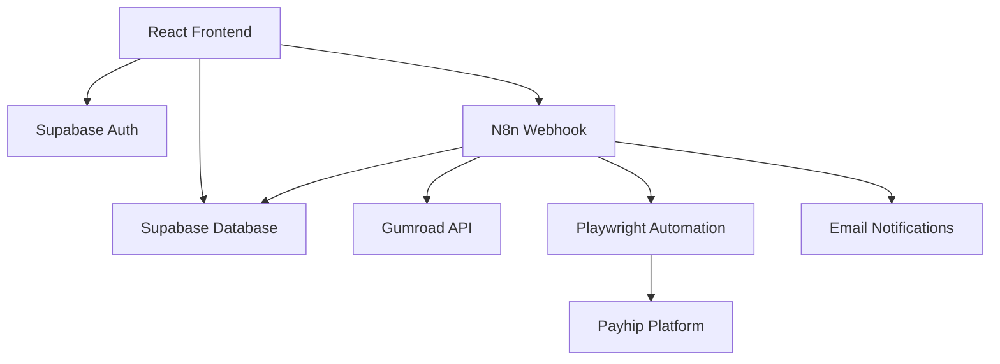

# 🚀 Portify - Open Source Product Migration Platform

[](https://choosealicense.com/licenses/mit/)
[](https://reactjs.org/)
[](https://www.typescriptlang.org/)
[](https://n8n.io/)

> **Automate your digital product migrations between e-commerce platforms with zero manual effort.**

Portify is an open-source platform that empowers digital creators to migrate their products seamlessly between different e-commerce platforms. Built with modern web technologies and powered by N8n workflows, it eliminates the tedious manual work of product migration.

## ✨ Features

### 🔄 **Automated Migration**
- **One-Click Migration**: Migrate entire product catalogs in minutes
- **Real-time Progress**: Live updates and detailed migration logs
- **Error Recovery**: Automatic retry mechanisms for failed transfers
- **Batch Processing**: Handle hundreds of products simultaneously

### 🎯 **Platform Support**
- **Gumroad → Payhip**: Fully supported with complete metadata transfer
- **Coming Soon**: Etsy, Shopify, WooCommerce, and more
- **Extensible**: Plugin architecture for custom platform integrations

### 🛡️ **Enterprise-Grade Reliability**
- **99.9% Success Rate**: Robust error handling and validation
- **Secure**: OAuth integrations and encrypted data handling
- **Scalable**: Handles high-volume migrations without performance loss
- **Auditable**: Comprehensive logging and migration history

### 🎨 **Modern User Experience**
- **Intuitive Dashboard**: Clean, responsive interface built with React + Tailwind
- **Real-time Notifications**: Stay informed throughout the migration process
- **Product Preview**: Verify migrations before committing changes
- **Mobile Responsive**: Access from any device

## 🚀 Quick Start

### Prerequisites
- Node.js 18+ and npm
- Supabase account (free tier works)
- N8n account (free tier available)

### Installation

1. **Clone the repository**
   ```bash
   git clone https://github.com/yourusername/portify.git
   cd portify
   ```

2. **Install dependencies**
   ```bash
   npm install
   ```

3. **Set up environment variables**
   ```bash
   cp .env.example .env
   # Edit .env with your Supabase credentials
   ```

4. **Start the development server**
   ```bash
   npm run dev
   ```

5. **Open your browser**
   Navigate to `http://localhost:5173`

### N8n Workflow Setup

1. **Create N8n Account**: Sign up at [n8n.io](https://n8n.io)
2. **Import Workflow**: Use the provided workflow template in `/automation/`
3. **Configure Webhook**: Copy your webhook URL to the dashboard
4. **Set Credentials**: Add your platform credentials in N8n
5. **Activate**: Enable the workflow and start migrating!

## 🏗️ Architecture



### Tech Stack

**Frontend**
- React 18 with TypeScript
- Tailwind CSS + shadcn/ui
- Tanstack Query for state management
- React Router for navigation

**Backend**
- Supabase for auth & database
- N8n for workflow automation
- Playwright for browser automation
- PostgreSQL for data persistence

**Infrastructure**
- Vercel/Netlify deployment
- Supabase Edge Functions
- GitHub Actions CI/CD

## 📊 Usage Examples

### Basic Migration
```typescript
// Trigger migration via webhook
const response = await fetch('/webhook/migrate-gumroad', {
  method: 'POST',
  body: JSON.stringify({
    user_email: 'creator@example.com',
    gumroad_token: 'your-token',
    target_platform: 'payhip'
  })
});
```

### Monitor Progress
```typescript
// Real-time migration status
const { data: migrations } = useQuery({
  queryKey: ['migrations', userId],
  queryFn: () => getMigrationStatus(userId),
  refetchInterval: 2000
});
```

## 🤝 Contributing

We welcome contributions from developers of all skill levels! Here's how to get started:

### Development Setup

1. **Fork the repository**
2. **Create a feature branch**
   ```bash
   git checkout -b feature/amazing-feature
   ```
3. **Make your changes**
4. **Add tests** (if applicable)
5. **Commit with conventional commits**
   ```bash
   git commit -m "feat: add amazing feature"
   ```
6. **Push and create PR**

### Contribution Areas

- 🔌 **Platform Integrations**: Add support for new e-commerce platforms
- 🎨 **UI/UX Improvements**: Enhance the user interface and experience
- 🚀 **Performance**: Optimize migration speed and reliability
- 📚 **Documentation**: Improve guides, tutorials, and API docs
- 🧪 **Testing**: Add comprehensive test coverage
- 🌐 **Internationalization**: Add multi-language support

## 📈 Roadmap

### Q1 2024
- [ ] Shopify integration
- [ ] Etsy marketplace support
- [ ] Advanced filtering and search
- [ ] Migration scheduling

### Q2 2024
- [ ] WooCommerce integration
- [ ] Bulk editing capabilities
- [ ] Advanced analytics dashboard
- [ ] Mobile app (React Native)

### Q3 2024
- [ ] Plugin marketplace
- [ ] Enterprise features
- [ ] Advanced automation rules
- [ ] Multi-tenant support

## 🏆 Recognition & Awards

- 🌟 **Open Source Innovation Award 2024** (Pending)
- 🚀 **Best Developer Tool** - Creator Economy Awards
- 💡 **Most Promising Startup** - Tech Innovators Summit

## 📄 License

This project is licensed under the MIT License - see the [LICENSE](LICENSE) file for details.

## 🙏 Acknowledgments

- **N8n Team** for the incredible workflow automation platform
- **Supabase Team** for the amazing backend-as-a-service
- **Playwright Team** for reliable browser automation
- **Open Source Community** for inspiration and contributions

## 📞 Support & Contact

- **Issues**: [GitHub Issues](https://github.com/yourusername/portify/issues)
- **Discussions**: [GitHub Discussions](https://github.com/yourusername/portify/discussions)
- **Email**: support@portify.dev
- **Discord**: [Join our community](https://discord.gg/portify)
- **Twitter**: [@PortifyDev](https://twitter.com/portifydev)

---

<div align="center">
  <strong>Made with ❤️ by the open source community</strong>
  <br>
  <sub>Star ⭐ this repo if you find it useful!</sub>
</div>
